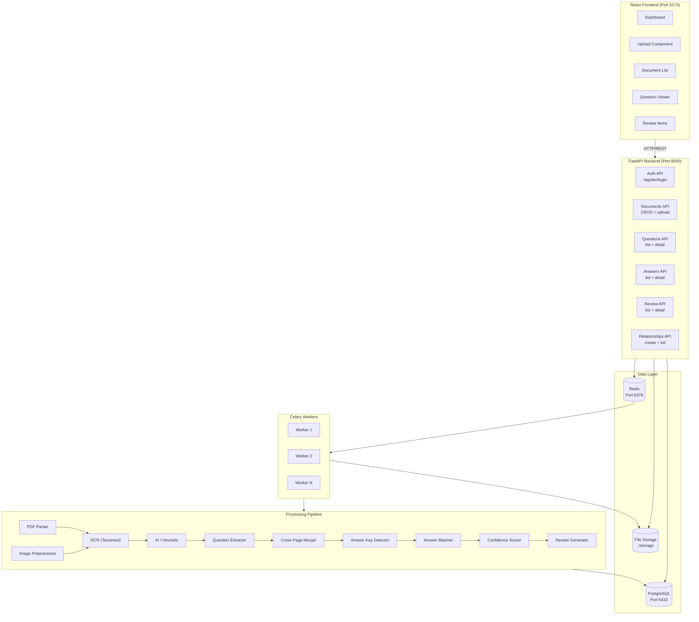

# Architecture Diagram

```mermaid
graph TB
    subgraph Frontend ["React Frontend (Port 5173)"]
        Dashboard["Dashboard"]
        Upload["Upload Component"]
        DocList["Document List"]
        QView["Question Viewer"]
        ReviewPage["Review Items"]
    end

    subgraph API ["FastAPI Backend (Port 8000)"]
        Auth["Auth API<br/>register/login"]
        DocAPI["Documents API<br/>CRUD + upload"]
        QAPI["Questions API<br/>list + detail"]
        AnsAPI["Answers API<br/>list + detail"]
        RevAPI["Review API<br/>list + detail"]
        RelAPI["Relationships API<br/>create + list"]
    end

    subgraph Data ["Data Layer"]
        PG[("PostgreSQL<br/>Port 5432")]
        Redis[("Redis<br/>Port 6379")]
        FS[("File Storage<br/>./storage")]
    end

    subgraph Workers ["Celery Workers"]
        W1["Worker 1"]
        W2["Worker 2"]
        W3["Worker N"]
    end

    subgraph Pipeline ["Processing Pipeline"]
        P1["PDF Parser"]
        P2["Image Preprocessor"]
        P3["OCR (Tesseract)"]
        P4["AI / Heuristic"]
        P5["Question Extractor"]
        P6["Cross-Page Merger"]
        P7["Answer Key Detector"]
        P8["Answer Matcher"]
        P9["Confidence Scorer"]
        P10["Review Generator"]
    end

    Frontend -->|HTTP/REST| API
    API --> PG
    API --> Redis
    API --> FS
    Redis --> Workers
    Workers --> Pipeline
    Workers --> FS
    Pipeline --> PG

    P1 --> P3
    P2 --> P3
    P3 --> P4
    P4 --> P5
    P5 --> P6
    P6 --> P7
    P7 --> P8
    P8 --> P9
    P9 --> P10
```
