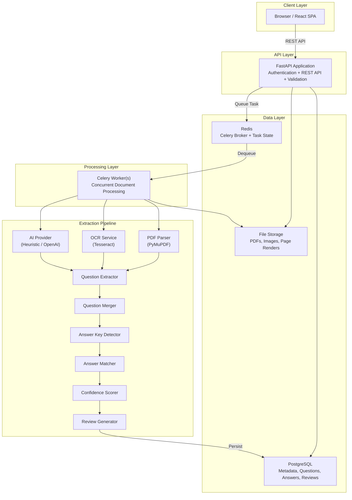

# Architecture Documentation

## System Architecture

## Component Overview

### React Frontend
- **Role**: User interface for document upload, status monitoring, question viewing, and review
- **Tech**: React 18, Vite, Tailwind CSS, React Router, Axios
- **State**: Auth context for JWT token management
- **Communication**: REST API calls with polling for processing status

### FastAPI Backend
- **Role**: API gateway, authentication, request validation, business logic orchestration
- **Tech**: FastAPI, Pydantic, SQLAlchemy (async), python-jose
- **Design**: Repository pattern separating data access from business logic
- **Auth**: JWT tokens with bcrypt password hashing, user-scoped data access

### PostgreSQL
- **Role**: Persistent storage for all structured data
- **Tables**: users, documents, document_pages, questions, question_options, question_sources, answer_keys, review_items, document_relationships
- **Features**: UUID primary keys, foreign key constraints, unique constraints, indexes

### Redis
- **Role**: Celery message broker and result backend
- **Usage**: Task queuing, task state tracking, worker coordination

### Celery Workers
- **Role**: Asynchronous document processing
- **Concurrency**: Multiple workers can process multiple documents simultaneously
- **Reliability**: ack-late, retry on failure, cleanup on re-processing

### File Storage
- **Role**: Store uploaded documents and rendered page images
- **Interface**: Abstract StorageProvider (save, get, delete, exists)
- **Default**: Local filesystem with path traversal protection
- **Extensible**: Can swap to S3, GCS, Azure Blob

## Security Architecture

- JWT authentication on all protected endpoints
- User-scoped data access (can only see own documents)
- File validation: extension, MIME type, magic bytes, size limit
- Safe filename generation (UUID-based)
- Path traversal protection in storage service
- No secrets in code (environment variables)
- Structured error responses (no sensitive data leakage)

## Scalability

- **Horizontal API scaling**: Stateless FastAPI instances behind load balancer
- **Horizontal worker scaling**: Multiple Celery workers with Redis broker
- **Database pooling**: SQLAlchemy connection pool (configurable)
- **Object storage**: Interface supports cloud storage providers
- **No shared state**: API servers share nothing except database and Redis

## Failure Handling

- Worker failures trigger retries (max 2)
- Failed documents marked as FAILED with error message
- Previous results cleaned up before retry (no duplicates)
- OCR/AI failures logged and produce review items
- Database errors rolled back
- Malformed AI responses create AI_EXTRACTION_ERROR review items
