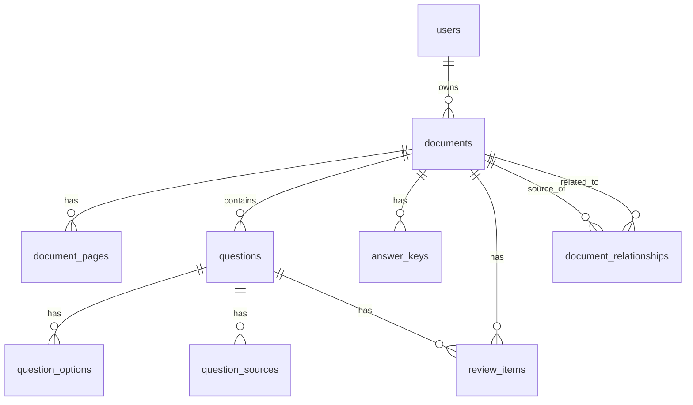

# Database Documentation

## Entity Relationship Diagram

## Tables

### users
| Column | Type | Constraints |
|--------|------|-------------|
| id | UUID | PK |
| email | VARCHAR(255) | UNIQUE, NOT NULL, INDEX |
| password_hash | VARCHAR(255) | NOT NULL |
| created_at | TIMESTAMPTZ | NOT NULL |
| updated_at | TIMESTAMPTZ | NOT NULL |

### documents
| Column | Type | Constraints |
|--------|------|-------------|
| id | UUID | PK |
| user_id | UUID | FK → users.id, CASCADE, INDEX |
| filename | VARCHAR(255) | NOT NULL |
| original_filename | VARCHAR(255) | NOT NULL |
| file_type | VARCHAR(10) | NOT NULL |
| file_size | BIGINT | NOT NULL |
| storage_path | VARCHAR(500) | NOT NULL |
| status | VARCHAR(20) | NOT NULL, INDEX |
| processing_error | TEXT | NULLABLE |
| total_pages | INTEGER | NULLABLE |
| processed_pages | INTEGER | NULLABLE |
| created_at | TIMESTAMPTZ | NOT NULL |
| updated_at | TIMESTAMPTZ | NOT NULL |

### document_pages
| Column | Type | Constraints |
|--------|------|-------------|
| id | UUID | PK |
| document_id | UUID | FK → documents.id, CASCADE, INDEX |
| page_number | INTEGER | NOT NULL |
| image_path | VARCHAR(500) | NULLABLE |
| raw_text | TEXT | NULLABLE |
| ocr_text | TEXT | NULLABLE |
| ocr_confidence | FLOAT | NULLABLE |
| rotation | FLOAT | NULLABLE |
| created_at | TIMESTAMPTZ | NOT NULL |

**Unique**: (document_id, page_number)

### questions
| Column | Type | Constraints |
|--------|------|-------------|
| id | UUID | PK |
| document_id | UUID | FK → documents.id, CASCADE, INDEX |
| question_number | VARCHAR(20) | NULLABLE |
| question_text | TEXT | NOT NULL |
| question_type | VARCHAR(20) | NOT NULL |
| answer | VARCHAR(50) | NULLABLE |
| answer_status | VARCHAR(20) | NOT NULL |
| answer_confidence | FLOAT | NULLABLE |
| confidence | FLOAT | NOT NULL |
| status | VARCHAR(20) | NOT NULL |
| review_required | BOOLEAN | NOT NULL |
| created_at | TIMESTAMPTZ | NOT NULL |
| updated_at | TIMESTAMPTZ | NOT NULL |

### question_options
| Column | Type | Constraints |
|--------|------|-------------|
| id | UUID | PK |
| question_id | UUID | FK → questions.id, CASCADE, INDEX |
| option_key | VARCHAR(10) | NOT NULL |
| option_text | TEXT | NOT NULL |
| created_at | TIMESTAMPTZ | NOT NULL |

### question_sources
| Column | Type | Constraints |
|--------|------|-------------|
| id | UUID | PK |
| question_id | UUID | FK → questions.id, CASCADE, INDEX |
| document_id | UUID | FK → documents.id, CASCADE, INDEX |
| page_number | INTEGER | NOT NULL |
| source_text | TEXT | NULLABLE |
| bounding_box | JSON | NULLABLE |
| created_at | TIMESTAMPTZ | NOT NULL |

### answer_keys
| Column | Type | Constraints |
|--------|------|-------------|
| id | UUID | PK |
| document_id | UUID | FK → documents.id, CASCADE, INDEX |
| question_number | VARCHAR(20) | NOT NULL |
| answer | VARCHAR(50) | NOT NULL |
| confidence | FLOAT | NOT NULL |
| source_page | INTEGER | NULLABLE |
| matched | BOOLEAN | NOT NULL |
| created_at | TIMESTAMPTZ | NOT NULL |

### review_items
| Column | Type | Constraints |
|--------|------|-------------|
| id | UUID | PK |
| document_id | UUID | FK → documents.id, CASCADE, INDEX |
| question_id | UUID | FK → questions.id, SET NULL, INDEX |
| issue_type | VARCHAR(30) | NOT NULL |
| reason | TEXT | NOT NULL |
| confidence | FLOAT | NULLABLE |
| source_page | INTEGER | NULLABLE |
| resolved | BOOLEAN | NOT NULL |
| created_at | TIMESTAMPTZ | NOT NULL |
| updated_at | TIMESTAMPTZ | NOT NULL |

### document_relationships
| Column | Type | Constraints |
|--------|------|-------------|
| id | UUID | PK |
| source_document_id | UUID | FK → documents.id, CASCADE, INDEX |
| related_document_id | UUID | FK → documents.id, CASCADE, INDEX |
| relationship_type | VARCHAR(20) | NOT NULL |
| created_at | TIMESTAMPTZ | NOT NULL |

**Unique**: (source_document_id, related_document_id, relationship_type)
