# Processing Pipeline Documentation

## Pipeline Flow

```mermaid
flowchart TD
    A["Upload via POST /api/v1/documents"] --> B["Validate file"]
    B -->|Extension check| B1["validate_file_extension()"]
    B -->|MIME check| B2["validate_mime_type()"]
    B -->|Magic bytes| B3["validate_file_content()"]
    B -->|Size check| B4["validate_file_size()"]

    B -->|Invalid| ERR1["Return 400/413/422 error"]
    B -->|Valid| C["Save to storage"]
    C --> D["Create Document record<br/>status = QUEUED"]
    D --> E["Push Celery task to Redis"]
    E --> F["Return 201 with document_id"]

    E -.->|Worker picks up task| G["Load Document from DB"]
    G --> H["Set status = PROCESSING"]
    H --> I{"File type?"}

    I -->|PDF| J["PDF Processing"]
    I -->|Image| K["Image Processing"]

    subgraph "PDF Processing"
        J --> J1["Get page count (PyMuPDF)"]
        J1 --> J2["For each page:"]
        J2 --> J3["Extract text (get_text)"]
        J3 --> J4{"Text quality OK?"}
        J4 -->|Yes| J5["Use extracted text"]
        J4 -->|No / empty| J6["Render page to image"]
        J6 --> J7["Preprocess image"]
        J7 --> J8["OCR image (Tesseract)"]
        J8 --> J5
        J5 --> J9["Save DocumentPage record"]
        J9 --> J10["Update processed_pages"]
    end

    subgraph "Image Processing"
        K --> K1["Resize if needed"]
        K1 --> K2["Preprocess for OCR"]
        K2 --> K3["OCR image (Tesseract)"]
        K3 --> K4["Save DocumentPage record"]
    end

    J10 --> L["Question Extraction"]
    K4 --> L

    subgraph "Extraction Pipeline"
        L --> L1["AI/Heuristic: extract_questions() per page"]
        L1 --> L2["Detect question patterns"]
        L2 --> L3["Extract options"]
        L3 --> L4["Detect question type"]
    end

    L4 --> M["Cross-Page Merge"]
    subgraph "Cross-Page Merge"
        M --> M1["Detect incomplete questions"]
        M1 --> M2["Check: ends mid-sentence?"]
        M2 --> M3["Check: next has no number?"]
        M3 --> M4["Merge text + combine source pages"]
    end

    M4 --> N["Answer Key Detection"]
    subgraph "Answer Key Detection"
        N --> N1["Scan last pages first"]
        N1 --> N2["Scan first pages"]
        N2 --> N3["Detect answer patterns<br/>1-A, Q1->A, etc."]
    end

    N3 --> O["Answer Matching"]
    subgraph "Answer Matching"
        O --> O1["Normalize question numbers"]
        O1 --> O2["Build answer lookup map"]
        O2 --> O3["Match by number"]
        O3 --> O4["Mark MATCHED / UNMATCHED"]
    end

    O4 --> P["Confidence Scoring"]
    subgraph "Confidence Scoring"
        P --> P1["OCR confidence signal"]
        P1 --> P2["Extraction confidence signal"]
        P2 --> P3["Structure quality signal"]
        P3 --> P4["Answer match signal"]
        P4 --> P5["Weighted average → 0.0-1.0"]
        P5 --> P6["Classify: EXTRACTED / PARTIAL / REVIEW_REQUIRED"]
    end

    P6 --> Q["Review Item Generation"]
    subgraph "Review Items"
        Q --> Q1["Low confidence?"]
        Q1 --> Q2["Missing number?"]
        Q2 --> Q3["Cross-page merge?"]
        Q3 --> Q4["Uncertain answer?"]
        Q4 --> Q5["Validation issues?"]
        Q5 --> Q6["Create ReviewItem records"]
    end

    Q6 --> R["Persist to PostgreSQL"]
    R --> R1["Save Questions"]
    R1 --> R2["Save QuestionOptions"]
    R2 --> R3["Save QuestionSources"]
    R3 --> R4["Save AnswerKeys"]
    R4 --> R5["Save ReviewItems"]

    R5 --> S{"Review items > 0?"}
    S -->|Yes| T["status = REVIEW_REQUIRED"]
    S -->|No| U["status = COMPLETED"]
    T --> V["Done"]
    U --> V

    G -->|Error| FAIL["status = FAILED<br/>Store error message"]
```

## OCR Decision Logic

For each PDF page, the system determines whether OCR is needed:

1. Extract text using `PyMuPDF.get_text()`
2. If text length < 20 characters → **needs OCR**
3. If printable character ratio < 70% → **needs OCR**
4. Otherwise → **use extracted text** (no unnecessary OCR)

## Image Preprocessing

Before OCR, images go through:
1. **Grayscale** conversion
2. **Denoising** (fastNlMeansDenoising)
3. **Adaptive thresholding** (for text contrast)
4. **Deskew** (rotation correction)
5. **Resize** (if dimensions exceed 4000px)

## Question Pattern Detection

The heuristic provider matches these patterns:
- `Q1.`, `Q.1`, `Question 1:` → Question with number
- `1.`, `1)`, `(1)` → Numbered question
- `(a)`, `A.`, `a)` → Options
- `True or False:` → TRUE_FALSE type
- `Fill in`, `Define`, `Explain` → SHORT_ANSWER type
